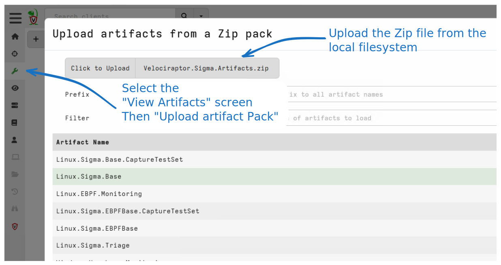

# Velociraptor Artifacts

The Velociraptor Sigma project contains a number of managed artifacts
that can be used in various situations. The artifacts contain a large
number of Sigma rules that can be customized as needed.

You can see the different artifacts on the sidebar in this page. To
import all these artifacts into Velociraptor you can use the built in
[Server.Import.CuratedSigma](https://docs.velociraptor.app/artifact_references/pages/server.import.curatedsigma/)
artifact, or import these manually by downloading the
[Velociraptor.Sigma.Artifacts.zip](https://sigma.velocidex.com/Velociraptor.Sigma.Artifacts.zip)
artifact pack.

If manually adding these artifacts:

1. Select `View Artifacts` in the sidebar
2. Click the `Upload Artifact Pack` button
3. Upload the file from the local filesystem
4. Import the artifacts you want (or all of them)

## Customizing the curated artifacts

Most users will need to customize the curated Sigma rules for their
environments. To learn how to do this, please read the [Customizing
Artifact Packs]() page.
