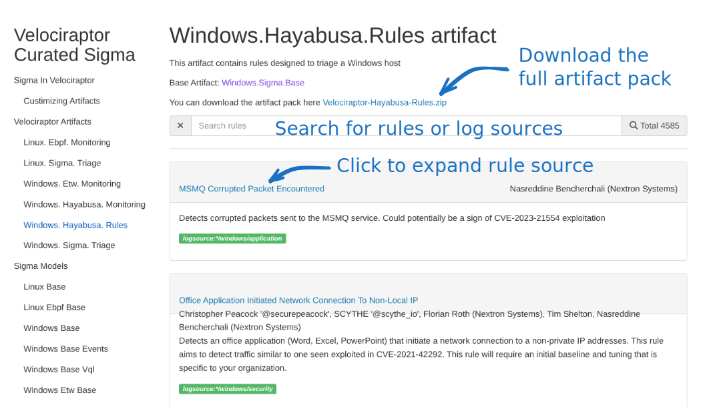
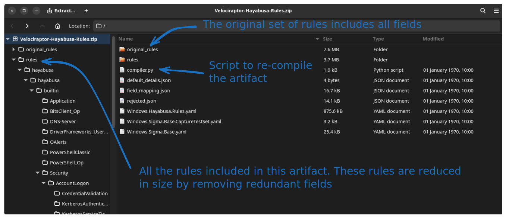

# Customizing Artifact Packs

This repository contains curated Sigma Artifacts used by a number of
different purposes (e.g. triaging, monitoring etc). Although Sigma
rules can be useful, it is important to customize the rule set for the
specific environment:

1. Remove rules that are false positives (fire too often)
2. Add rules specific to our environment
3. Update rules to tune them to our specific environment.

Velociraptor's Sigma artifacts make this very easy by following a
simple process.

## Downloading the full curated artifact packs

The Velociraptor Sigma repository maintains a set of curated Sigma
rules in specialized artifacts. The rules are packed easily into the
artifact for ease of use and deployment - usually you only need to
import the artifact pack into Velociraptor and then continue to hunt
your environment using these rules.

You can download all the rules that make up the artifact and
reconstruct the artifact using some easy steps. You will find a link
to the full artifact pack on the website.



For the following example, we will update the Velociraptor Hayabusa
Ruleset. As shown above the site allows for quickly viewing the rules
incorporated in this artifact, but to customize the artifact we need
to download the full artifact pack.

The artifact pack is a Zip file containing all you need to reconstruct
the artifact.



The pack contains:

1. The original rules used to build the pack. This includes the full
   Sigma rule including comments and all fields.
2. The rules actually packed into the artifact. We reduce the size of
   the artifact by removing unnecessary fields from the rules.
3. A small python script that helps us to repack the `rules/`
   directory into a new artifact.

### Curating the rules

For many environments the full ruleset is too noisy as it produces a
lot of false positives. Many rules may also require tuning specific to
your environment.

We recommend that you manage your own rule sets using a version
control system, such as `git` and sync the rules from upstream
periodically:

1. You may delete any of the rules that you do not want to include in
   the reconstituted artifact.
2. You can add new rules - **providing that you understand the
   relevant Sigma Model**
3. You can modify any of the rules to improve their efficacy for your
   environment.

### Reconstituting the artifact.

The artifact pack also contains a copy of the Velociraptor artifact
and a short python script that can be used to reconstitute the
artifact with the new ruleset.

To understand what the script does let's look at the artifact itself:

```sql
sources:
- query: |
    LET Rules <= gunzip(string=base64decode(string="H4sIAAAAAAAA/+z93....."))

    SELECT *
    FROM Artifact.Windows.Sigma.Base(
      ROOT=ROOT, RuleLevel=RuleLevel, RuleStatus=RuleStatus,
      RuleTitleFilter=RuleTitleFilter, RuleExclusions=RuleExclusions,
      DateAfter=DateAfter, DateBefore=DateBefore,
      SigmaRules=Rules, NTFS_CACHE_TIME=NTFS_CACHE_TIME)
```

The artifact simply packages a compressed and encoded string
containing all the rules as a YAML list. At run time, the string is
expanded and passed to the relevant base artifact. It is this base
artifact that implements the relevant Sigma Model.

You can find out more about this model in the relevant part of the
[Velociraptor Sigma website]()

Therefore, to reconstruct the artifact all we need to do is to join
together all the new rules into a large string, compress it with
`gzip` and encode it in `base64`.

This is essentially what the `compiler.py` script does:

```text
$ python compiler.py -h
usage: compiler.py [-h] artifact rule_dir

positional arguments:
  artifact    The artifact file to modify
  rule_dir    Path to the top level rules directory

options:
  -h, --help  show this help message and exit
```

To rebuild:
```text
python compiler.py Windows.Hayabusa.Rules.yaml rules > new_artifact.yaml
```

### Importing the new script into the server

You may want to edit the new artifact to change its name or make extra
notes in it.

To import it into the server you may paste it in the artifact editor,
but the artifact may be too large to copy into the browser.

A better way is to import the artifact using a notebook:

```sql
SELECT artifact_set(definition=read_file(filename=OSPath)).name AS Name
FROM glob(globs="/opt/sigma/*.yaml")
```

Where `/opt/sigma/` is a directory on the server where you can upload
all the customized Sigma artifacts.
